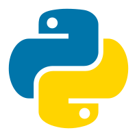

### Hi, I'm YZ Fly 👋

Welcome to my profile! I'm a deep learning researcher,  part-time science fiction writer and full-time life voyager. Thanks for visiting!

⭐ Projects that I'm working on:
|Projects|Stars|Introduction|备注|
|---|---|---|---|
| [🤖 ChatGPT 中文指南](https://github.com/yzfly/awesome-chatgpt-zh) |  |Curated ChatGPT Resource List| 更好的使用 chatGPT 🚀 |
| [LangGPT](https://github.com/yzfly/LangGPT) |  |Language of GPT, Structured Prompts| LangGPT 结构化提示词🔥 |
|[中文 prompt 精选🔥](https://github.com/yzfly/wonderful-prompts)||high-quality Chinese prompts|中文精选提示词|
|[🧠 Awesome Claude Prompts](https://github.com/yzfly/awesome-claude-prompts)||high-quality Claude prompts| Claude 精选提示词|
|[Awesome-Multimodal-Prompts](https://github.com/yzfly/Awesome-Multimodal-Prompts)||Awesome Multimodal Prompts| 多模态提示词|
|[AutoNetGen](https://github.com/EmbraceAGI/AutoNetGen)||AI designs AI ✨.|让大模型帮助小模型进化|

⚡ Languages and Tools:

 
 

🏆  Github Stats:

<!--
        

-->

<!--
**yzfly/yzfly** is a ✨ _special_ ✨ repository because its `README.md` (this file) appears on your GitHub profile.

Here are some ideas to get you started:

- 🔭 I’m currently working on ...
- 🌱 I’m currently learning ...
- 👯 I’m looking to collaborate on ...
- 🤔 I’m looking for help with ...
- 💬 Ask me about ...
- 📫 How to reach me: ...
- 😄 Pronouns: ...
- ⚡ Fun fact: ...

selecting color: https://coolors.co/palettes/trending
-->
