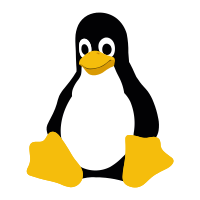
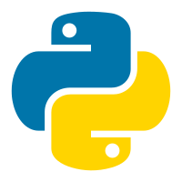
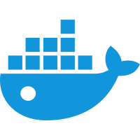

### Hi, I'm YZ Fly 👋

Welcome to my profile! I'm a deep learning researcher,  part-time science fiction writer and full-time life voyager. Thanks for visiting!

⭐ Projects that I'm working on:
- [HAVPRLab_Action](https://github.com/yzfly/HAVPRLab_Action)
- [TCM](https://github.com/yzfly/TCM)
- [RNN_LSTM_GRU_PyTorch](https://github.com/yzfly/RNN_LSTM_GRU_PyTorch)
- [ActionDetection](https://github.com/yzfly/ActionDetection)
- [SimpleTreeHeight](https://github.com/yzfly/SimpleTreeHeight)

⚡ Languages and Tools:

 
 

🏆  Github Stats:

        

<!--
**yzfly/yzfly** is a ✨ _special_ ✨ repository because its `README.md` (this file) appears on your GitHub profile.

Here are some ideas to get you started:

- 🔭 I’m currently working on ...
- 🌱 I’m currently learning ...
- 👯 I’m looking to collaborate on ...
- 🤔 I’m looking for help with ...
- 💬 Ask me about ...
- 📫 How to reach me: ...
- 😄 Pronouns: ...
- ⚡ Fun fact: ...

selecting color: https://coolors.co/palettes/trending
-->
